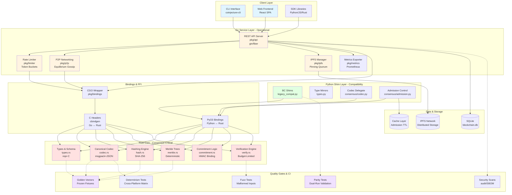
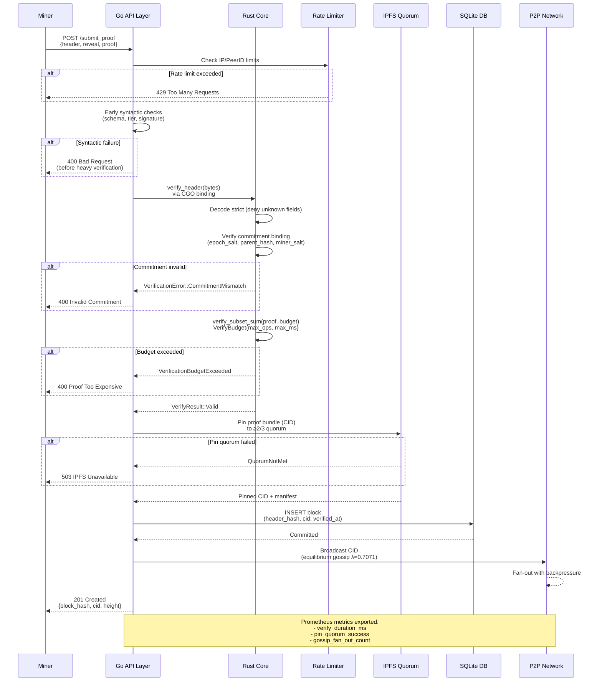
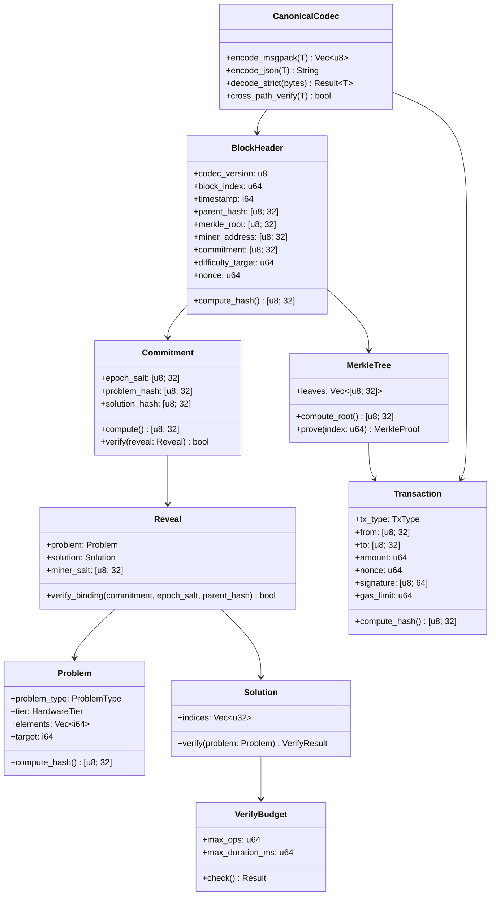
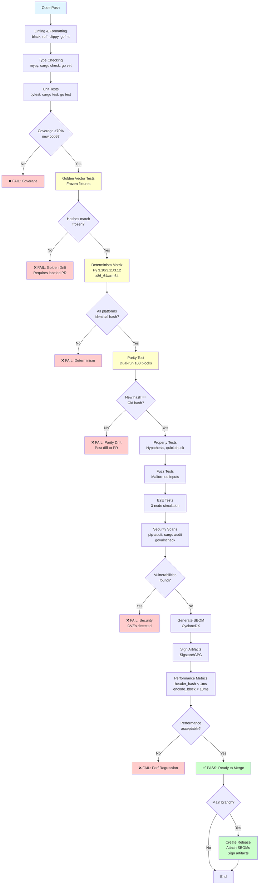
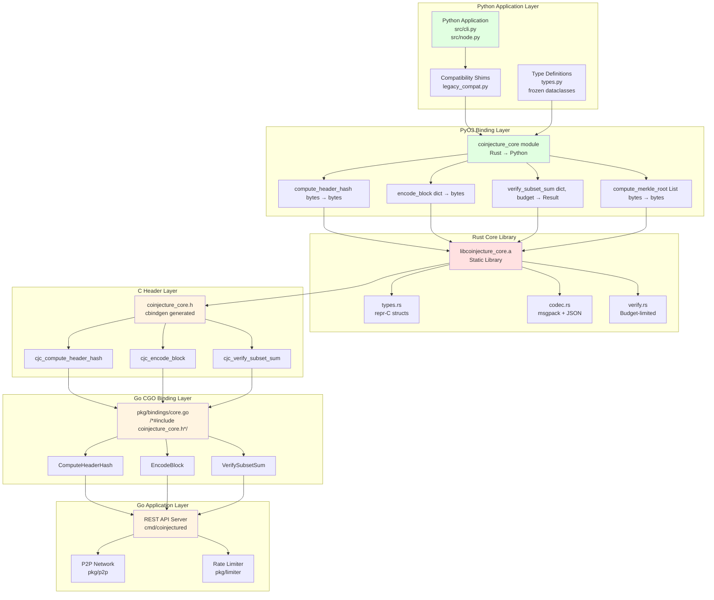
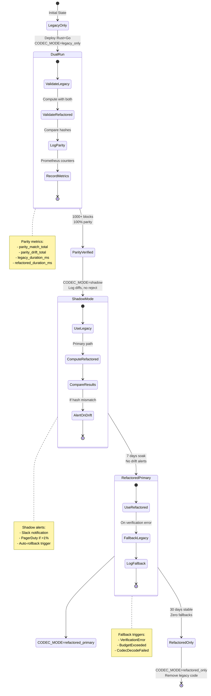
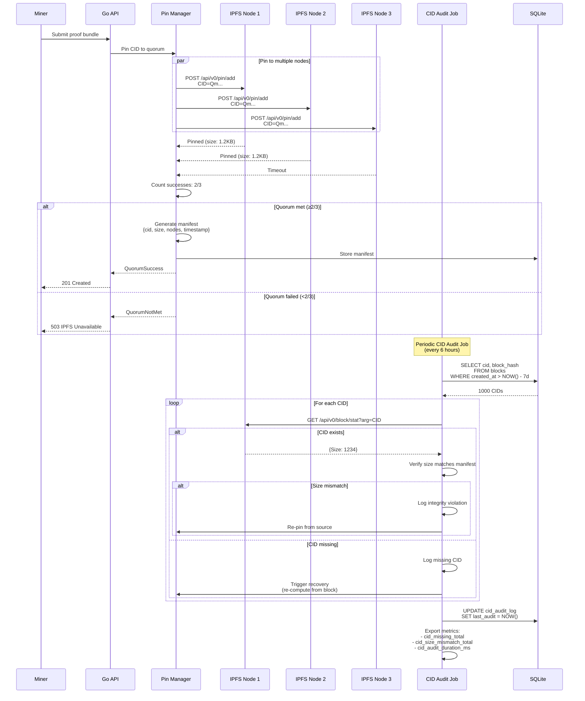
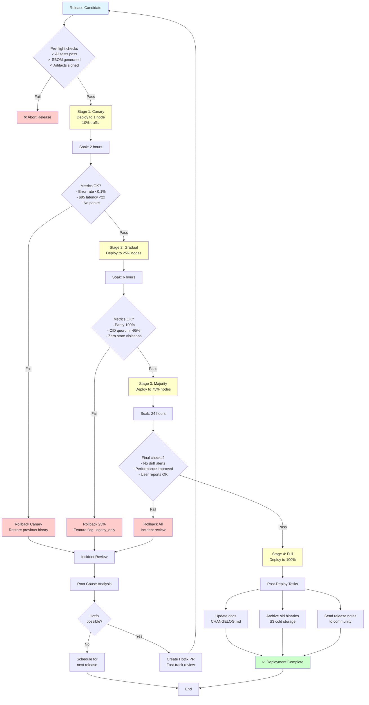

# COINjecture Institutional-Grade Refactor Architecture

**Version:** 4.0.0-REFACTOR
**Date:** 2025-11-04
**Lead:** Multi-Agent Refactor Team
**Target:** Bank/FI-Class Requirements

---

## Executive Summary

This document defines the complete architectural transformation of COINjecture from a Python monolith to a multi-language, institutional-grade system with:

- **Rust Core**: Consensus-critical logic (deterministic, verifiable, reproducible)
- **Go Networking/API**: Concurrent, isolated, observable, rate-limited
- **Python Shims**: Backwards compatibility + legacy glue
- **Quality Gates**: Golden vectors, parity testing, determinism, SBOM, signing

---

## Architectural Overview



---

## Data Flow: Block Submission & Verification



---

## Consensus-Critical Type System



---

## Security Architecture: Defense-in-Depth

```mermaid
graph LR
    subgraph "Layer 1: Network Edge"
        A1[IP Rate Limit<br/>100 req/min]
        A2[Peer Scoring<br/>Reputation]
        A3[DDoS Detection<br/>Burst Limits]
    end

    subgraph "Layer 2: Early Reject"
        B1[Schema Validation<br/>Deny Unknown Fields]
        B2[Tier Check<br/>Element Count]
        B3[Signature Verify<br/>Ed25519]
        B4[Timestamp Window<br/>±2h max skew]
    end

    subgraph "Layer 3: Admission Control"
        C1[Epoch Replay Cache<br/>commitment, epoch TTL]
        C2[Nonce Sequence<br/>Per-Address]
        C3[Gas Estimation<br/>Pre-compute]
    end

    subgraph "Layer 4: Consensus Verification"
        D1[Commitment Binding<br/>HMAC parent_hash, epoch_salt]
        D2[Subset Sum Verify<br/>VerifyBudget max_ops, max_ms]
        D3[Merkle Root Check<br/>Deterministic]
        D4[Difficulty Target<br/>Cumulative Work]
    end

    subgraph "Layer 5: IPFS Integrity"
        E1[Pin Quorum<br/>≥2/3 nodes]
        E2[CID Audit<br/>Size/Hash Match]
        E3[Manifest Signing<br/>Provenance]
    end

    subgraph "Layer 6: State Transition"
        F1[Balance Invariants<br/>No Inflation]
        F2[Reorg Protection<br/>Max Depth 100]
        F3[State Root<br/>Post-Block]
    end

    A1 --> A2
    A2 --> A3
    A3 --> B1

    B1 --> B2
    B2 --> B3
    B3 --> B4
    B4 --> C1

    C1 --> C2
    C2 --> C3
    C3 --> D1

    D1 --> D2
    D2 --> D3
    D3 --> D4
    D4 --> E1

    E1 --> E2
    E2 --> E3
    E3 --> F1

    F1 --> F2
    F2 --> F3

    F3 --> G[Accept Block]

    A1 -.->|429| Reject1[Reject:<br/>Rate Limited]
    B1 -.->|400| Reject2[Reject:<br/>Malformed]
    C1 -.->|409| Reject3[Reject:<br/>Replay]
    D2 -.->|400| Reject4[Reject:<br/>Budget Exceeded]
    E1 -.->|503| Reject5[Reject:<br/>IPFS Unavailable]
    F1 -.->|500| Reject6[Reject:<br/>State Violation]

    style A1 fill:#ffcccc
    style A2 fill:#ffcccc
    style A3 fill:#ffcccc
    style B1 fill:#ffe6cc
    style B2 fill:#ffe6cc
    style B3 fill:#ffe6cc
    style B4 fill:#ffe6cc
    style C1 fill:#ffffcc
    style C2 fill:#ffffcc
    style C3 fill:#ffffcc
    style D1 fill:#ccffcc
    style D2 fill:#ccffcc
    style D3 fill:#ccffcc
    style D4 fill:#ccffcc
    style E1 fill:#cce6ff
    style E2 fill:#cce6ff
    style E3 fill:#cce6ff
    style F1 fill:#e6ccff
    style F2 fill:#e6ccff
    style F3 fill:#e6ccff
    style G fill:#ccffcc
```



---

## CI/CD Quality Gates Pipeline



---

## Rust-Python-Go Binding Architecture



---

## Feature Flag & Cutover Strategy



---

## IPFS Pinning Quorum & CID Audit



---

## Deployment & Rollback Procedures



---

## Repository Structure

```
COINjecture1337-REFACTOR/
│
├── rust/
│   └── coinjecture-core/
│       ├── Cargo.toml                      # Dependencies, features, metadata
│       ├── Cargo.lock                      # Pinned dependency versions
│       ├── src/
│       │   ├── lib.rs                      # Crate root, module exports
│       │   ├── types.rs                    # repr(C) structs, enums
│       │   ├── codec.rs                    # Canonical msgpack + JSON codec
│       │   ├── hash.rs                     # SHA-256 hashing engine
│       │   ├── merkle.rs                   # Deterministic Merkle trees
│       │   ├── commitment.rs               # HMAC commitment binding
│       │   ├── verify.rs                   # Subset sum with budget limits
│       │   ├── errors.rs                   # Typed error enums (no panics)
│       │   └── python.rs                   # PyO3 bindings module
│       ├── tests/
│       │   ├── golden_tests.rs             # Golden vector validation
│       │   ├── determinism_tests.rs        # Cross-platform matrix
│       │   ├── codec_tests.rs              # Strict decode, equivalence
│       │   └── property_tests.rs           # quickcheck properties
│       ├── benches/
│       │   └── benchmarks.rs               # Criterion.rs benchmarks
│       └── golden/
│           ├── genesis.json                # Genesis block fixture
│           ├── headers.json                # Header test vectors
│           ├── transactions.json           # Transaction fixtures
│           └── merkle.json                 # Merkle tree vectors
│
├── go/
│   ├── go.mod                              # Go module definition
│   ├── go.sum                              # Dependency checksums
│   ├── cmd/
│   │   └── coinjectured/
│   │       └── main.go                     # Daemon entry point
│   ├── pkg/
│   │   ├── api/
│   │   │   ├── server.go                   # Gin/Fiber HTTP server
│   │   │   ├── handlers.go                 # Endpoint handlers
│   │   │   └── middleware.go               # CORS, auth, logging
│   │   ├── p2p/
│   │   │   ├── network.go                  # Equilibrium gossip
│   │   │   ├── peer_scoring.go             # Reputation system
│   │   │   └── backpressure.go             # Flow control
│   │   ├── limiter/
│   │   │   ├── rate_limiter.go             # Token bucket implementation
│   │   │   ├── ip_limiter.go               # IP-based limits
│   │   │   └── peer_limiter.go             # Peer-ID limits
│   │   ├── ipfs/
│   │   │   ├── client.go                   # IPFS API client
│   │   │   ├── quorum.go                   # Pin quorum logic
│   │   │   ├── audit.go                    # CID audit job
│   │   │   └── manifest.go                 # Manifest generation
│   │   ├── metrics/
│   │   │   ├── exporter.go                 # Prometheus exporter
│   │   │   └── slo.go                      # SLO definitions
│   │   ├── bindings/
│   │   │   └── core.go                     # CGO wrapper to Rust
│   │   └── config/
│   │       └── config.go                   # Configuration structs
│   ├── internal/
│   │   └── logger/
│   │       └── logger.go                   # Structured logging
│   └── scripts/
│       ├── build.sh                        # Build script
│       └── deploy.sh                       # Deployment script
│
├── python/
│   └── src/
│       └── coinjecture/
│           ├── __init__.py                 # Package init, BC shims
│           ├── types.py                    # Frozen dataclasses
│           ├── consensus/
│           │   ├── codec.py                # Delegates to Rust
│           │   └── admission.py            # Epoch replay, nonce checks
│           ├── proofs/
│           │   ├── interface.py            # Solver ABC
│           │   └── limits.py               # Tier validation
│           └── legacy_compat.py            # Dual-run validator
│
├── .github/
│   └── workflows/
│       ├── ci.yml                          # Main CI pipeline
│       ├── determinism.yml                 # Cross-platform matrix
│       ├── parity.yml                      # Dual-run validation
│       └── security.yml                    # Audits + SBOM generation
│
├── docs/
│   ├── REFACTOR_ARCHITECTURE.md            # This document
│   ├── CODEOWNERS                          # Code owner assignments
│   ├── RUNBOOKS.md                         # Operational runbooks
│   ├── SLO.md                              # Service level objectives
│   └── RELEASE_POLICY.md                   # Release procedures
│
├── scripts/
│   ├── generate_golden.py                  # Generate golden vectors
│   ├── run_parity_test.sh                  # Dual-run test harness
│   ├── rollout.sh                          # Gradual rollout script
│   └── rollback.sh                         # Emergency rollback
│
├── SECURITY_AUDIT.md                       # Security findings & mitigations
├── CHANGELOG.md                            # Version history
└── README.md                               # Project overview
```

---

## Success Metrics & SLOs

| Metric | Target | Measurement | Alert Threshold |
|--------|--------|-------------|-----------------|
| **Determinism** | 100% hash parity across platforms | Golden vector tests | Any divergence |
| **Parity** | 100% legacy vs refactored match | Dual-run validation | >0.1% drift |
| **Performance** | `compute_header_hash` < 1ms | Criterion benchmarks | >2ms p95 |
| **Performance** | `encode_block` < 10ms | Criterion benchmarks | >20ms p95 |
| **Performance** | `merkle(1k tx)` < 50ms | Criterion benchmarks | >100ms p95 |
| **Verification** | p95 within tier budgets | Prometheus metrics | >1.5x budget |
| **API Rate Limit** | <2% 429s for legit peers | HTTP response codes | >5% 429s |
| **IPFS Quorum** | >95% pin success | Pin manager metrics | <90% success |
| **CID Integrity** | <1% missing/mismatch | Audit job metrics | >5% missing |
| **Test Coverage** | ≥70% new code, ≥50% overall | `cargo tarpaulin`, `go test -cover` | Below threshold |
| **API Uptime** | 99.5% | Health check endpoint | <99% over 7d |
| **Consensus** | Zero state violations | Invariant checks | Any violation |

---

## Institutional Compliance Checklist

- [ ] **Determinism**: Canonical serialization, field order, strict decode
- [ ] **Reproducible Builds**: Lockfiles, pinned deps, artifact signing
- [ ] **Change Control**: CODEOWNERS, labeled PR for golden changes, code review
- [ ] **Defense-in-Depth**: 6 security layers (network → state transition)
- [ ] **Separation of Concerns**: Rust (pure), Go (operational), Python (glue)
- [ ] **Observability**: Prometheus metrics, SLOs, structured logs
- [ ] **Runbooks**: Rollout, rollback, incident response, soak tests
- [ ] **Compliance**: SBOMs (CycloneDX), security audits, signed releases
- [ ] **Testing**: Golden, property, fuzz, E2E, parity, determinism
- [ ] **Zero Drift**: Feature flags, dual-run, gradual cutover

---

**Document Status:** Living Architecture Document
**Next Review:** Post-Phase 1 Implementation
**Owner:** Multi-Agent Refactor Lead (Claude)
