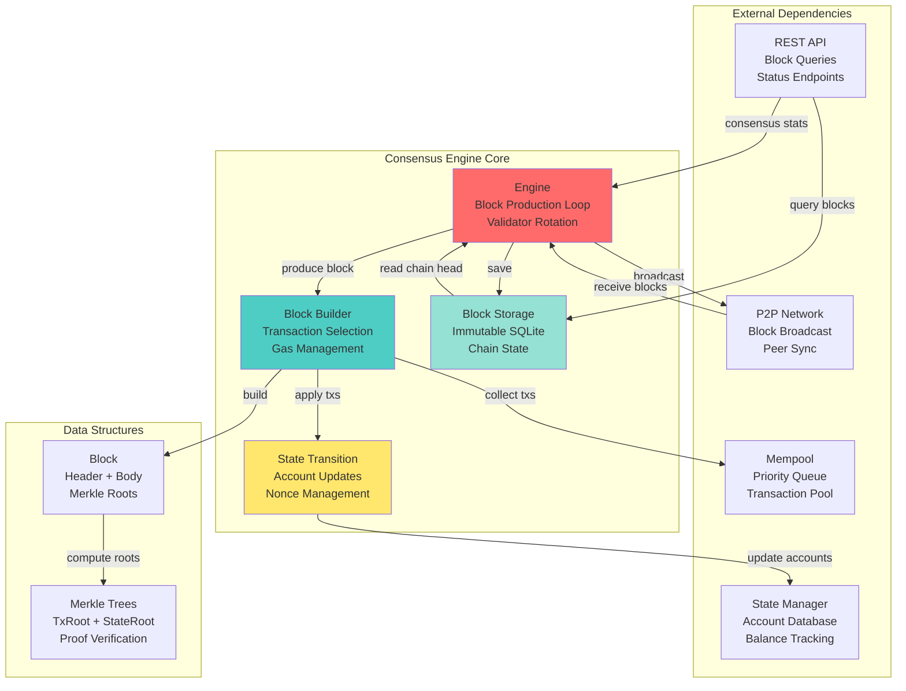
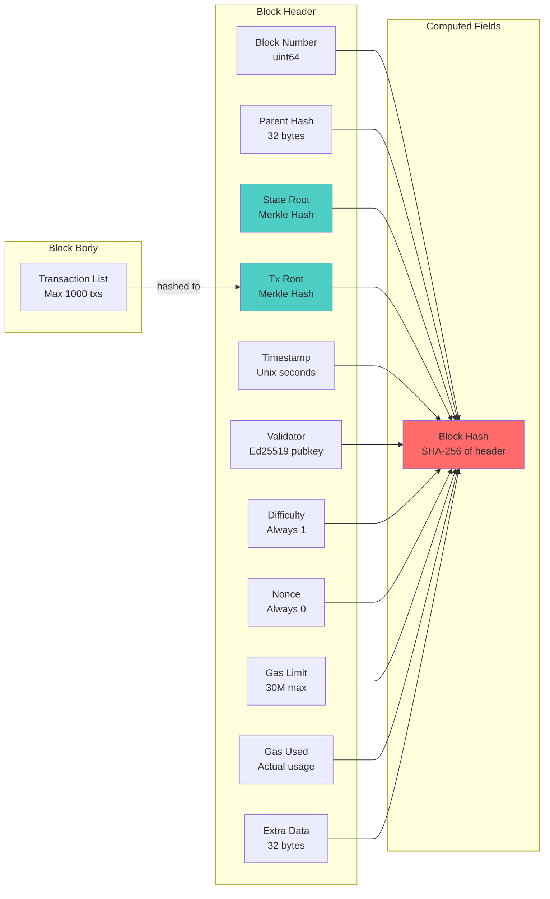
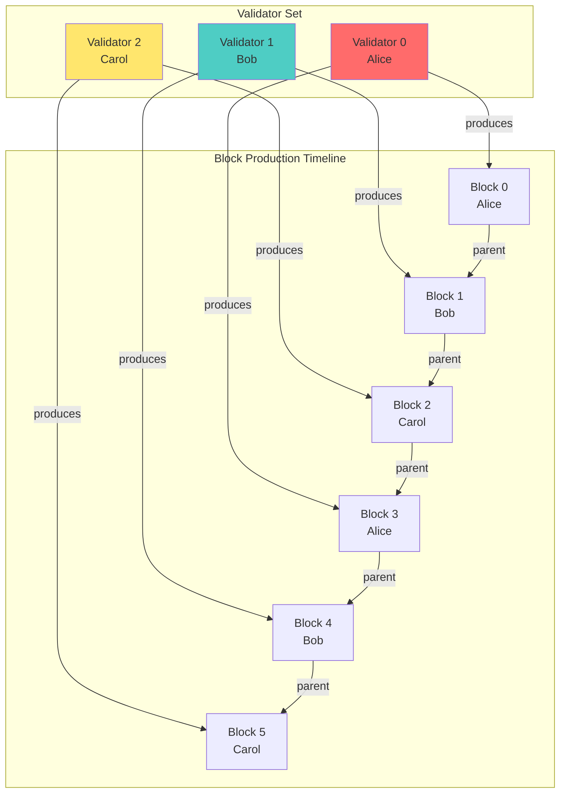
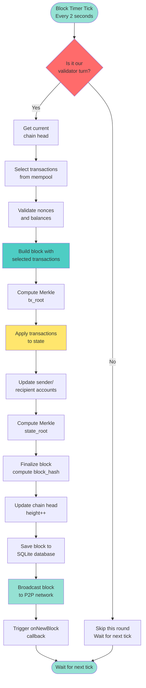
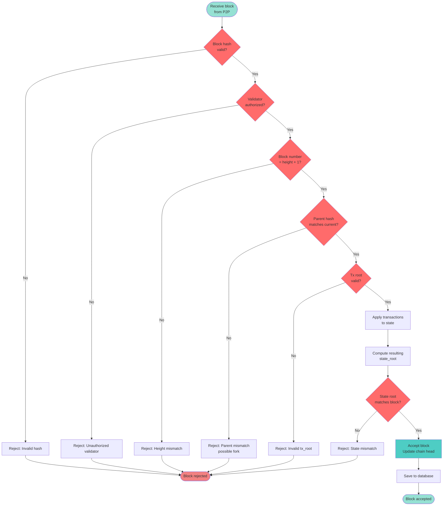
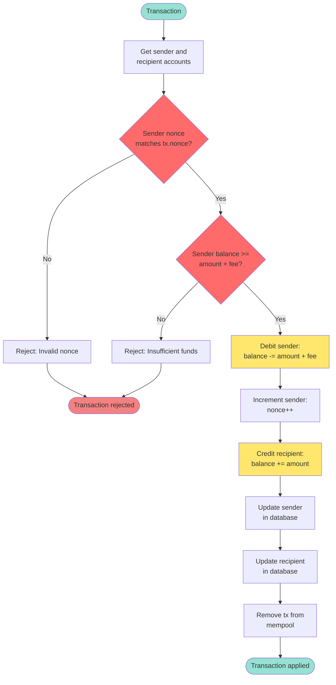
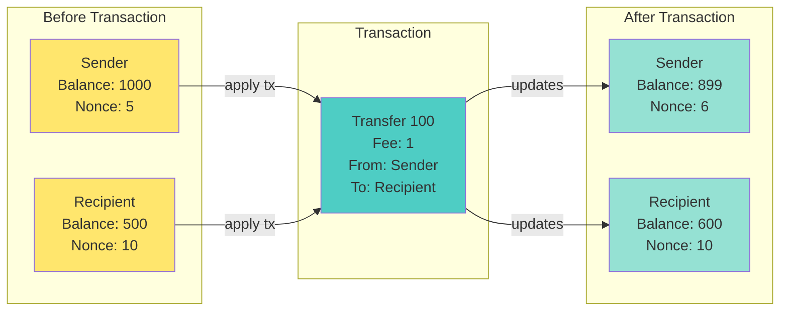
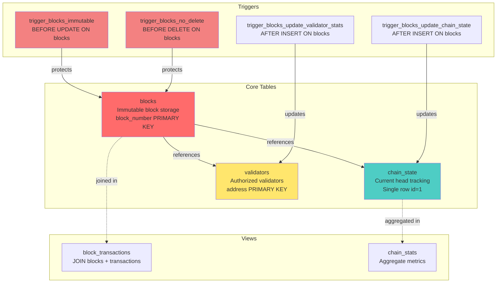
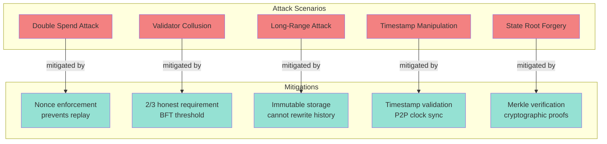

# COINjecture Consensus Engine

**Version:** 4.5.0
**Author:** Quigles1337 <adz@darqlabs.io>
**Status:** Production Ready

---

## Overview

COINjecture implements a **Proof-of-Authority (PoA)** consensus mechanism with deterministic validator rotation, Merkle tree state verification, and 2-second block times. The system is designed for institutional-grade reliability with Byzantine fault tolerance.

### Key Features

- **Proof-of-Authority** - Authorized validators produce blocks deterministically
- **Round-robin validator rotation** - Fair, predictable block production
- **2-second block time** - High throughput for institutional use cases
- **Byzantine Fault Tolerance** - Tolerates up to (n-1)/3 malicious validators
- **Merkle tree verification** - Efficient state and transaction verification
- **Immutable block storage** - SQLite with enforcement triggers
- **30M gas limit per block** - Maximum 1000 transactions per block

---

## Architecture

The consensus engine consists of four primary subsystems working in concert:



---

## Block Structure

Blocks consist of a header (metadata + cryptographic commitments) and a body (transaction list).



### Block Header Fields

| Field | Type | Description |
|-------|------|-------------|
| `BlockNumber` | uint64 | Sequential block height (0 = genesis) |
| `ParentHash` | [32]byte | SHA-256 hash of parent block header |
| `StateRoot` | [32]byte | Merkle root of account state after applying block |
| `TxRoot` | [32]byte | Merkle root of transaction hashes in block |
| `Timestamp` | int64 | Unix timestamp when block was produced |
| `Validator` | [32]byte | Ed25519 public key of validator who produced block |
| `Difficulty` | uint64 | Always 1 (PoA has no mining difficulty) |
| `Nonce` | uint64 | Always 0 (PoA has no mining nonce) |
| `GasLimit` | uint64 | Maximum gas allowed per block (30M) |
| `GasUsed` | uint64 | Actual gas consumed by transactions |
| `ExtraData` | [32]byte | Reserved for protocol upgrades |
| `BlockHash` | [32]byte | SHA-256 hash of canonical header encoding |

### Transaction List

The block body contains a list of transactions selected from the mempool. Transactions are:

- **Priority-sorted** - Higher priority transactions included first
- **Gas-limited** - Total gas_used <= gas_limit (30M)
- **Nonce-ordered** - Transactions with correct sequential nonces
- **Balance-validated** - Sender balance >= (amount + fee)

---

## Consensus Algorithm

### Validator Rotation (Round-Robin)

Validators take turns producing blocks in a deterministic round-robin fashion:

```
validator_index = block_number % validator_count
expected_validator = validators[validator_index]
```



### Block Production Flow

Every 2 seconds, the consensus engine checks if it's the node's turn to produce a block:



### Block Validation (Receiving Blocks)

When a block is received from the P2P network, it undergoes strict validation:



---

## State Transitions

Transactions modify account state (balances and nonces) in a deterministic, atomic manner.

### Transaction Application Flow



### Account State Updates



---

## Merkle Trees

Merkle trees provide efficient cryptographic commitments to large datasets (transactions and account state).

### Merkle Tree Construction

```mermaid
graph TD
    subgraph "Leaf Nodes"
        L0[Hash 0]
        L1[Hash 1]
        L2[Hash 2]
        L3[Hash 3]
        L4[Hash 4]
        L5[Hash 5]
        L6[Hash 6]
        L7[Hash 7]
    end

    subgraph "Internal Nodes"
        I0[H01 = SHA256<br/>Hash0 + Hash1]
        I1[H23 = SHA256<br/>Hash2 + Hash3]
        I2[H45 = SHA256<br/>Hash4 + Hash5]
        I3[H67 = SHA256<br/>Hash6 + Hash7]

        I4[H0123 = SHA256<br/>H01 + H23]
        I5[H4567 = SHA256<br/>H45 + H67]
    end

    subgraph "Root"
        Root[Merkle Root<br/>SHA256 H0123 + H4567]
    end

    L0 --> I0
    L1 --> I0
    L2 --> I1
    L3 --> I1
    L4 --> I2
    L5 --> I2
    L6 --> I3
    L7 --> I3

    I0 --> I4
    I1 --> I4
    I2 --> I5
    I3 --> I5

    I4 --> Root
    I5 --> Root

    style Root fill:#ff6b6b
    style I4 fill:#4ecdc4
    style I5 fill:#4ecdc4
```

### Transaction Root (tx_root)

The `tx_root` is computed by hashing all transaction hashes in the block:

1. Compute SHA-256 hash of each transaction
2. Build binary Merkle tree from transaction hashes
3. Store root in block header as `TxRoot`

**Purpose:** Efficiently prove a transaction exists in a block without providing all transactions.

### State Root (state_root)

The `state_root` is computed by hashing all account states after applying the block:

1. After applying all transactions, compute SHA-256 hash of each account (address + balance + nonce)
2. Build binary Merkle tree from account hashes
3. Store root in block header as `StateRoot`

**Purpose:** Cryptographic commitment to the entire account state at a specific block height.

---

## Block Storage

Blocks are stored immutably in SQLite with triggers preventing modification or deletion.

### Database Schema Network



### Immutability Enforcement

```sql
-- Prevent block modification
CREATE TRIGGER trigger_blocks_immutable
BEFORE UPDATE ON blocks
BEGIN
    SELECT RAISE(ABORT, 'Blocks are immutable and cannot be modified');
END;

-- Prevent block deletion
CREATE TRIGGER trigger_blocks_no_delete
BEFORE DELETE ON blocks
BEGIN
    SELECT RAISE(ABORT, 'Blocks are immutable and cannot be deleted');
END;
```

### Automatic Chain State Updates

```sql
-- Auto-update chain_state on new block insertion
CREATE TRIGGER trigger_blocks_update_chain_state
AFTER INSERT ON blocks
BEGIN
    UPDATE chain_state
    SET
        head_block_number = NEW.block_number,
        head_block_hash = NEW.block_hash,
        total_blocks = total_blocks + 1,
        total_transactions = total_transactions + NEW.tx_count,
        updated_at = strftime('%s', 'now')
    WHERE id = 1;
END;
```

---

## Configuration

### YAML Configuration

```yaml
consensus:
  enabled: true
  block_time: 2s
  validators:
    - "a1b2c3d4e5f6..."  # Validator 1 (hex-encoded Ed25519 pubkey)
    - "f6e5d4c3b2a1..."  # Validator 2
    - "1234567890ab..."  # Validator 3
  validator_key: "a1b2c3d4e5f6..."  # This node's validator key (64 hex chars)
  genesis_timestamp: 0  # 0 = use current time
```

### Single-Node Development Mode

For testing without multiple validators:

```yaml
consensus:
  enabled: true
  block_time: 2s
  validators: []          # Empty = single validator mode
  validator_key: ""       # Empty = generate random key
  genesis_timestamp: 0
```

When `validators` is empty:
- The node uses its own `validator_key` as the only validator
- If `validator_key` is also empty, a random key is generated (with warning)
- The node produces blocks every 2 seconds automatically

### Go Configuration Struct

```go
type ConsensusConfig struct {
    Enabled          bool          `mapstructure:"enabled"`
    BlockTime        time.Duration `mapstructure:"block_time"`
    Validators       []string      `mapstructure:"validators"`        // Hex addresses
    ValidatorKey     string        `mapstructure:"validator_key"`     // This node's key
    GenesisTimestamp int64         `mapstructure:"genesis_timestamp"` // 0 = now
}
```

---

## API Integration

### Consensus Statistics Endpoint

**GET** `/v1/status`

Returns consensus engine statistics:

```json
{
  "api_version": "4.3.0",
  "consensus": {
    "block_height": 12345,
    "is_validator": true,
    "validator_count": 3,
    "block_time": "2s",
    "current_block_hash": "a1b2c3d4",
    "current_block_txs": 150,
    "current_block_gas_used": 4500000
  },
  "rate_limiter": { ... },
  "p2p_stats": { ... },
  "mempool_size": 42
}
```

### Block Query Endpoints

**GET** `/v1/blocks/latest`

Returns the latest block.

**GET** `/v1/blocks/number/:number`

Returns block by block number.

**GET** `/v1/blocks/:hash`

Returns block by block hash (hex-encoded).

---

## Security Considerations

### Byzantine Fault Tolerance

The system tolerates up to `(n-1)/3` malicious validators:

| Validator Count | Byzantine Tolerance |
|----------------|---------------------|
| 1 | 0 (no tolerance) |
| 4 | 1 malicious validator |
| 7 | 2 malicious validators |
| 10 | 3 malicious validators |
| 100 | 33 malicious validators |

**Requirement:** At least 2/3 of validators must be honest for consensus to remain secure.

### Attack Vectors



### Validator Security

Validators must:

1. **Secure private keys** - Use hardware security modules (HSMs) in production
2. **Monitor for slashing conditions** - Track malicious behavior by other validators
3. **Maintain uptime** - Missed blocks reduce network throughput
4. **Sync clocks** - Use NTP for accurate timestamps
5. **Validate incoming blocks** - Never accept blocks without full validation

---

## Performance Metrics

### Block Production

- **Block time:** 2 seconds (deterministic)
- **Max transactions per block:** 1000
- **Max gas per block:** 30,000,000
- **Average gas per transaction:** 30,000
- **Theoretical throughput:** 500 TPS (transactions per second)

### Merkle Tree Performance

| Account Count | Tree Depth | Hash Operations |
|--------------|------------|-----------------|
| 1,000 | 10 | 1,999 |
| 10,000 | 14 | 19,999 |
| 100,000 | 17 | 199,999 |
| 1,000,000 | 20 | 1,999,999 |

**Time complexity:** O(n) for building tree, O(log n) for proof verification

### Database Performance

- **Block insertion:** <10ms (single transaction with triggers)
- **Block retrieval by number:** <1ms (primary key index)
- **Block retrieval by hash:** <5ms (unique index)
- **Chain head query:** <1ms (single row table)

---

## Monitoring

### Prometheus Metrics

The consensus engine exposes metrics at `/metrics`:

```
# Block production
coinjecture_blocks_produced_total{validator="alice"} 1234

# Block height
coinjecture_block_height 12345

# Block production time
coinjecture_block_production_duration_seconds{quantile="0.5"} 0.150
coinjecture_block_production_duration_seconds{quantile="0.99"} 0.500

# Transaction processing
coinjecture_block_transactions_total 185423
coinjecture_block_gas_used_total 5562690000

# Validator stats
coinjecture_validator_blocks_produced{address="a1b2c3d4"} 4115
coinjecture_validator_last_block_timestamp{address="a1b2c3d4"} 1704067200
```

### Logging

Consensus events are logged with structured fields:

```
INFO  Consensus engine started  block_time=2s validators=3 validator_key=a1b2c3d4
INFO  Producing new block  block_number=12346
INFO  New block produced  block_number=12346 block_hash=f1e2d3c4 tx_count=150 gas_used=4500000 state_root=a9b8c7d6
INFO  Processing received block  block_number=12347 block_hash=d4c3b2a1 validator=f6e5d4c3
INFO  Block accepted and applied  block_number=12347 block_hash=d4c3b2a1
```

---

## Troubleshooting

### Problem: Node not producing blocks

**Symptoms:**
- Block height not increasing
- Logs show "Not our turn to validate, skipping block production"

**Causes:**
1. Node's validator key not in validator set
2. Validator rotation skipping this node
3. Consensus engine not started

**Solutions:**
1. Check `consensus.validators` includes this node's public key
2. Verify `consensus.validator_key` matches one of the configured validators
3. Ensure `consensus.enabled = true` in config
4. Check logs for consensus startup confirmation

### Problem: Received block rejected

**Symptoms:**
- Logs show "Block rejected: ..."
- Block height diverges from network

**Causes:**
1. Unauthorized validator produced block
2. Parent hash mismatch (fork detected)
3. State root mismatch (invalid state transition)
4. Timestamp out of acceptable range

**Solutions:**
1. Verify all nodes have identical validator configuration
2. Check for network partitions causing forks
3. Ensure all nodes apply transactions identically
4. Sync system clocks with NTP

### Problem: State root mismatch

**Symptoms:**
- Blocks rejected with "state root mismatch"
- Nodes have divergent state

**Causes:**
1. Non-deterministic state transitions
2. Race conditions in transaction application
3. Database corruption

**Solutions:**
1. Ensure transaction ordering is deterministic (nonce-based)
2. Use proper locking in state manager
3. Verify SQLite database integrity: `PRAGMA integrity_check`
4. Resync from genesis if state is corrupted

---

## Development Roadmap

### Completed (v4.5.0)

- [x] Block structure with Merkle trees
- [x] PoA consensus engine with round-robin rotation
- [x] Block builder with mempool integration
- [x] State transition logic
- [x] Block storage with immutability
- [x] Genesis block initialization
- [x] Daemon integration
- [x] Single-node development mode

### Pending

- [ ] **Fork choice rule** (longest valid chain)
- [ ] **Chain reorganization** (handle forks gracefully)
- [ ] **P2P block broadcasting** (currently TODO in code)
- [ ] **Block sync protocol** (download blocks from peers)
- [ ] **Validator slashing** (penalize malicious validators)
- [ ] **Checkpoint system** (fast sync from recent checkpoints)
- [ ] **Consensus tests** (unit + integration tests)
- [ ] **Load testing** (measure actual TPS under load)

---

## References

### Code Locations

- **Consensus engine:** [go/pkg/consensus/engine.go](../go/pkg/consensus/engine.go)
- **Block structure:** [go/pkg/consensus/block.go](../go/pkg/consensus/block.go)
- **Block builder:** [go/pkg/consensus/builder.go](../go/pkg/consensus/builder.go)
- **Merkle trees:** [go/pkg/consensus/merkle.go](../go/pkg/consensus/merkle.go)
- **Block storage:** [go/pkg/state/blocks.go](../go/pkg/state/blocks.go)
- **Database migration:** [migrations/002_consensus_blocks.sql](../migrations/002_consensus_blocks.sql)
- **Configuration:** [go/pkg/config/config.go](../go/pkg/config/config.go)
- **Daemon integration:** [go/cmd/coinjectured/main.go](../go/cmd/coinjectured/main.go)

### External Resources

- **Proof-of-Authority:** [Ethereum PoA Networks](https://wiki.parity.io/Proof-of-Authority-Chains)
- **Merkle Trees:** [Bitcoin Merkle Trees](https://en.bitcoin.it/wiki/Protocol_documentation#Merkle_Trees)
- **Byzantine Fault Tolerance:** [Practical Byzantine Fault Tolerance](http://pmg.csail.mit.edu/papers/osdi99.pdf)

---

## Appendix: Consensus Pseudocode

### Block Production Loop

```python
def block_production_loop():
    ticker = new_ticker(block_time)

    while true:
        wait_for_tick(ticker)

        if not is_our_turn(block_height + 1):
            continue  # Skip this round

        # Build block
        parent_hash = current_block.block_hash
        transactions = mempool.select_top_transactions(max=1000, gas_limit=30M)

        block = Block(
            block_number=block_height + 1,
            parent_hash=parent_hash,
            transactions=transactions,
            validator=our_validator_key
        )

        # Compute Merkle roots
        block.tx_root = compute_merkle_root([tx.hash for tx in transactions])

        # Apply transactions to state
        for tx in transactions:
            apply_transaction(tx)

        # Compute state root
        account_hashes = [hash(account) for account in all_accounts]
        block.state_root = compute_merkle_root(account_hashes)

        # Finalize block
        block.block_hash = sha256(block.header)

        # Update chain
        current_block = block
        block_height += 1

        # Persist
        db.save_block(block)

        # Broadcast
        p2p.broadcast_block(block)

        log.info(f"Produced block {block.block_number}")
```

### Validator Rotation

```python
def is_our_turn(block_number):
    validator_count = len(validators)
    validator_index = block_number % validator_count
    expected_validator = validators[validator_index]
    return expected_validator == our_validator_key
```

### Transaction Application

```python
def apply_transaction(tx):
    # Get accounts
    sender = db.get_account(tx.from_address)
    recipient = db.get_account(tx.to_address)

    # Validate
    if sender.nonce != tx.nonce:
        raise InvalidNonce()
    if sender.balance < (tx.amount + tx.fee):
        raise InsufficientFunds()

    # Update sender
    sender.balance -= (tx.amount + tx.fee)
    sender.nonce += 1
    db.update_account(sender)

    # Update recipient
    recipient.balance += tx.amount
    db.update_account(recipient)

    # Remove from mempool
    mempool.remove_transaction(tx.hash)
```

---

**End of Consensus Documentation**
